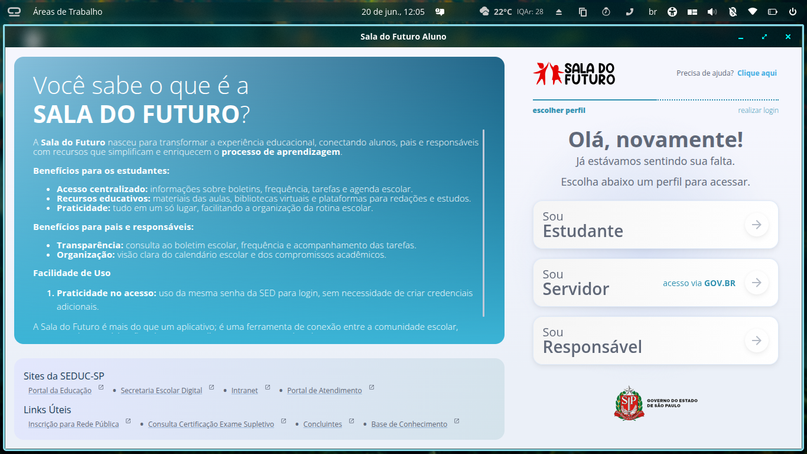

<!--suppress HtmlDeprecatedAttribute -->
<div align="center">
  <br>
  
  <h1>Sala do Futuro</h1>

  <p>Aplicativo web educacional para a Sala do Futuro - Pop!_OS COSMIC. Navegador Chromium com aceleracao de hardware e API Vulkan para melhor performance.</p>

  <br>

  

<br><br><br>

  <a href='https://github.com/felix-the-cat177/sala-do-futuro-for-pop-os-cosmic-webapp'>
    
  </a>
</div>

# Sobre

A **Sala do Futuro** é um aplicativo web educacional desenvolvido exclusivamente para o ambiente COSMIC no Pop!_OS. Este projeto é um fork do [web-apps for cosmic](https://github.com/cosmic-utils/web-apps), adaptado para atender as necessidades da Sala do Futuro.

## Funcionalidades

- 🚀 **Navegador Chromium integrado** - Maior compatibilidade com sites modernos
- ⚡ **API Vulkan** - Aceleracao de hardware para melhor performance
- 🎨 **Integracao com COSMIC** - Interface nativa e integrada ao sistema
- 🔔 **Notificacoes em segundo plano** - Receba alertas de tarefas, redacoes e provas
- 📦 **Pacote .deb** - Facilita a instalacao no Pop!_OS

# Requisitos

- Pop!_OS com ambiente COSMIC
- Rust (versao mais recente)
- Dependencias do CEF (Chromium Embedded Framework)

# Instalacao

## Metodo 1: Construcao manual

Clone o repositorio:

```bash
git clone https://github.com/felix-the-cat177/sala-do-futuro-for-pop-os-cosmic-webapp.git
cd sala-do-futuro-for-pop-os-cosmic-webapp
```

Construa o projeto:

```bash
cargo build --release
```

## Metodo 2: Usando o pacote .deb

Execute o script de construcao do pacote:

```bash
./scripts/build-deb.sh
```

Instale o pacote gerado:

```bash
sudo apt install ./sala-do-futuro-webapp_1.0.0_amd64.deb
```

# Uso

Após a instalacao, o aplicativo estará disponível no menu de aplicativos do COSMIC como "Sala do Futuro".

Para acessar a plataforma educacional:
- URL padrao: `https://saladofuturo.educacao.sp.gov.br/escolha-de-perfil`

# Estrutura do Projeto

```
sala-do-futuro-webapp/
├── src/
│   ├── bin/
│   │   ├── sala-do-futuro-webapp/  # Aplicativo principal
│   │   └── webview/                # Navegador Chromium
│   ├── browser.rs                  # Configuracao do navegador
│   ├── launcher.rs                 # Lancador de webapps
│   └── lib.rs                      # Biblioteca compartilhada
├── resources/
│   ├── icons/                      # Icones do aplicativo
│   ├── dev.heppen.webapps.desktop  # Arquivo desktop
│   └── dev.heppen.webapps.metainfo.xml  # Metadados
├── scripts/
│   └── build-deb.sh                # Script de build .deb
└── Cargo.toml                      # Configuracao Rust
```

# Integracao com COSMIC

O aplicativo utiliza a `libcosmic` para se integrar perfeitamente ao ambiente COSMIC:

- Painel de aplicacoes com a logo da Sala do Futuro
- Notificacoes em segundo plano para atividades escolares
- Temas personalizados
- Suporte a modo claro/escuro

# Desenvolvimento

Este projeto é um fork do [web-apps for cosmic](https://github.com/cosmic-utils/web-apps) e está sendo adaptado exclusivamente para a Sala do Futuro.

## Contribuindo

Contribuicoes sao bem-vindas! Sinta-se à vontade para abrir issues ou pull requests.

# Licenca

GPL-3.0-only - Mesmo licenciamento do projeto original.

# Links Uteis

- [Repositorio Original](https://github.com/cosmic-utils/web-apps)
- [libcosmic](https://github.com/pop-os/libcosmic)
- [Pop!_OS](https://pop.system76.com/)
- [COSMIC Desktop](https://cosmic.system76.com/)
- [Sala do Futuro site oficial da SEDUC](https://saladofuturo.educacao.sp.gov.br/)

---

Desenvolvido com ❤️ para a Sala do Futuro
